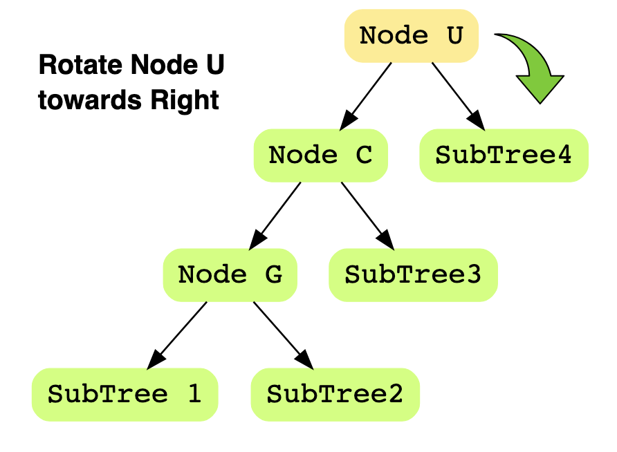
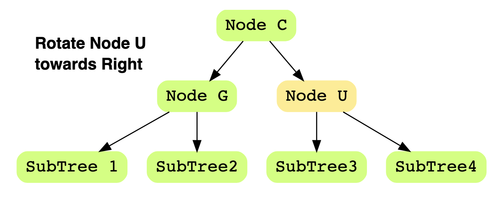

AVL Tree is a self balancing [[Binary Search Tree]]
# Terms 
Node U - an unbalanced node 
Node C - child node of node U 
Node G - grandchild node of node U 
# Insertion Cases 
Left-Left: Node C is the left-child of Node U, and Node G is left-child of Node C
Left-Right: Node C is the left-child of Node U, and Node G is right-child of Node C 
Right-Right: Node C is the right-child of Node U, and Node G is right-child of Node C
Right-Left: Node C is the right-child of Node U, and Node G is left-child of Node C 
## Case 1: Left-Left 

    
    

